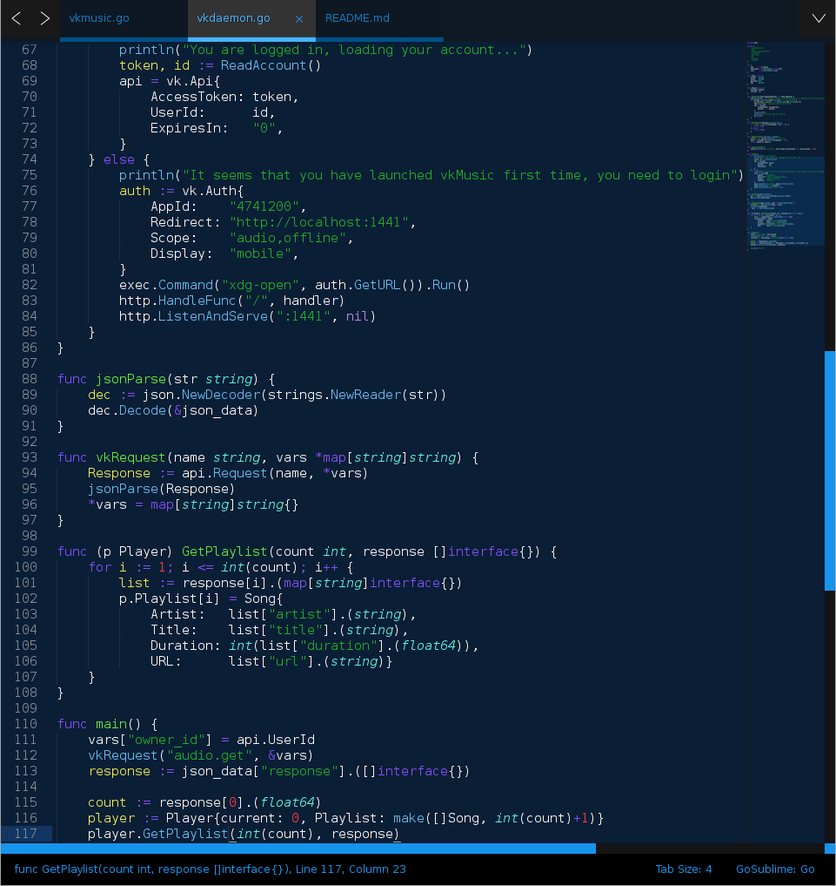

# Code-Lover-pack
Code-Lover theme for SublimeText 2

(Brogrammer theme remade with main blue color + my syntax highlight theme)

# Screenshot


# Install
edit ```
/home/$USER/.config/sublime-text-2/Packages/User
```

add this lines

```
"color_scheme": "Packages/Colorsublime-Themes/Code-Lover.tmTheme",
"theme": "Packages/Colorsublime-Themes/Code-Lover.sublime-theme",
```
